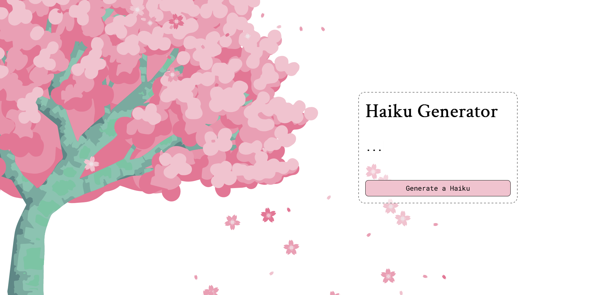

# Mixed Messages
This project is based on a project prompt from the site codecademy.com. The aim was to create a page that generated a random message. 

I chose to create a webpage that generates a random haiku as flowers and petals fall in the background. To challenge myself I implemented JavaScript animations for the background petals and flowers and typing out the haiku.

## Install
1. Download ZIP
2. Open index.html

